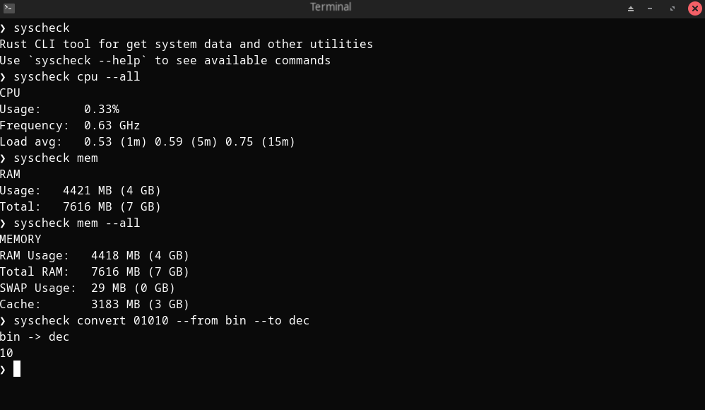

# Welcome


syscheck is a lightweight binary rust for linux than give you varius tool, like monitor tools and other utilities like convert numbers
or check system information. The project uses clap to join the varius tools.




## Tools


The number of tools increases over time; they are mainly divided into 
monitoring tools and various utilities.

The standar input of the program is:

```rust
syscheck <command> --FLAG
```

You aslo can use syscheck --help or syscheck <comand> --help.


### cpu


This tool just prints the percentage of use of the processor, admits "--all" flag and "--ghz" for only frequency.

```rust
syscheck cpu

CPU
- Usage: 4.03%
- Freq: 0.52 GHz
```


### mem


This tool displays the main system memories: RAM, swap, and cache. It supports the "--all", "--cache", 
and "--swap" flags.

```rust
syscheck mem --all

MEMORY
- RAM used: 4476 MB (4 GB)
- Total RAM: 7616 MB (7 GB)
- SWAP used: 228 MB (0 GB)
- Cached: 2924 MB (2 GB)
```

### convert


This is one of the utilitis, you can convert numbers between binary, decimal, hexadecimal and octal, it aslo parse
the prefixes that numbers usually have "0x00007fc9928f9000". in "syscheck convert --help" you can found how to use it.

```rust
syscheck convert 0x00007fc9928f9000 --from hex --to bin

hex -> bin
11111111100100110010010100011111001000000000000

```

## other tools

- temp: It displays the processor or motherboard temperature.

- info: Displays general system information.

## Advantages

- Just one lightweight binary.
- Memory safe thanks to Rust.
- It can be integrated into any ecosystem.
- It doesn't use any libraries other than clap and fs for reading "/proc".
- Scalable, there is no limit to the number of tools.
